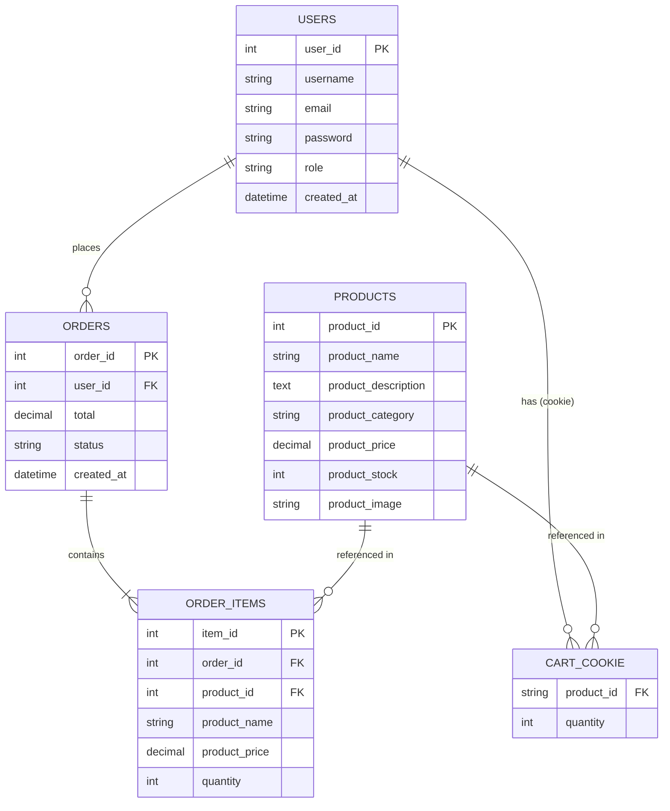

# ShopLocal: A Web-Based Local E-Commerce Platform

**A Project Manuscript**

---

**Submitted by:** [Your Name]
**Course:** [Your Course]
**Institution:** [Your School/University]
**Date:** April 29, 2026

---

## Objectives

1. Build a functional e-commerce web application with product listing and purchasing workflows.
2. Implement secure user authentication with registration, login, and profile management.
3. Enforce role-based access control separating admin and customer capabilities.
4. Provide a persistent cookie-based shopping cart that works without login.
5. Support product image uploads from the administrator's machine.
6. Deliver a responsive, accessible user interface for desktop and mobile.

---

## Entity Relationship Diagram

> **Note:** `CART_COOKIE` is not a database table — it is stored as a JSON cookie in the user's browser. `ORDER_ITEMS` stores a snapshot of the product name and price at the time of purchase, so the record remains accurate even if the product is later edited or deleted.

---

*End of Manuscript*
